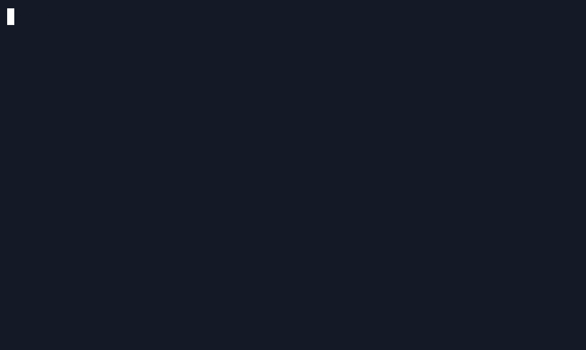

# sample-app-gif

The sample app used for the gif and video embedded in the docs. The purpose is for it to be complex enough to show the core value propositions of Score:

- Convert to more than one deployment format
- Provision ingress and database resources with dynamic credentials
- Launch locally or remotely
- Show evidence that the request was routed correctly and hit the target database

All with as few lines of code as possible. We're going to for simple and short rather than _correct_.

This starts a simple server connected to a Postgres database, and then on each request returns something like:

```
HTTP/1.1 200 OK
Server: nginx/1.25.4
Date: Thu, 23 May 2024 16:39:34 GMT
Content-Type: text/plain; charset=utf-8
Content-Length: 127
Connection: keep-alive
X-Env: docker

SQL VERSION: PostgreSQL 16.1 on aarch64-unknown-linux-musl, compiled by gcc (Alpine 13.2.1_git20231014) 13.2.1 20231014, 64-bit%
```

- Cleaned .cast file: [score-demo.cast](score-demo.cast)
- Modified .cast file with new timings: [score-demo.modified.cast](score-demo.modified.cast)
- Output gif: [score-demo.gif](score-demo.gif)

    

## How to record the sample gif

Use <https://docs.asciinema.org/>.

Preparation:

```
$ docker compose down -v
$ kubectl --context kind-kind delete -f manifests.yaml
$ rm -rfv .score-compose .score-k8s compose.yaml manifests.yaml
$ docker pull ghcr.io/score-spec/sample-app-gif:sha-2533037

$ kind delete cluster
$ ./setup-kind.sh
```

Instructions to record:

**NOTE**: for best results you should manually type as many of these as you can

```
$ asciinema rec score-demo.cast --overwrite -c sh

$ cat score.yaml
$ score-compose init
$ score-compose generate score.yaml
$ docker compose up -d </dev/null | cat
$ curl -i http://${host}:8080
$ docker compose logs sample-main
$ clear

$ score-k8s init
$ score-k8s generate score.yaml
$ kubectl apply -f manifests.yaml
$ kubectl wait deployments/sample --for=condition=Available
$ export host=$(score-k8s resources get-outputs 'dns.default#sample.dns' --format '{{ .host }}') && printenv host
$ curl -i http://${host}

$ kubectl delete -f manifests.yaml
```

Then manually clean up the cast file as needed to remove any mistakes or bad lines. To adjust the timings and highlight the prompt segment, install and run <https://github.com/astromechza/asciinema-adjuster>:

```
$ asciinema-adjuster score-demo.cast 'sh-3.2$ ' > score-demo.modified.cast
```

Then run `agg` to render the gif. `agg` can be installed from <https://docs.asciinema.org/manual/agg/>.

```
agg --theme 141926,ffffff,141926,f92672,0cd6ae,f4bf75,638aff,8667fd,a1efe4,ffffff,75715e,f92672,0cd6ae,f4bf75,638aff,8667fd,a1efe4,ffffff \
    --font-size 20 --font-family 'Fira Code' --font-dir ./Fira_Code/ \
    --cols 80 --rows 20 \
    score-demo.modified.cast score-demo.gif
```

To generate an optimised gif about half the size, install `gifsicle` and then run:

```
gifsicle --lossy=80 -k 64 -O2 -Okeep-empty score-demo.gif -o score-demo-lossy.gif
```
